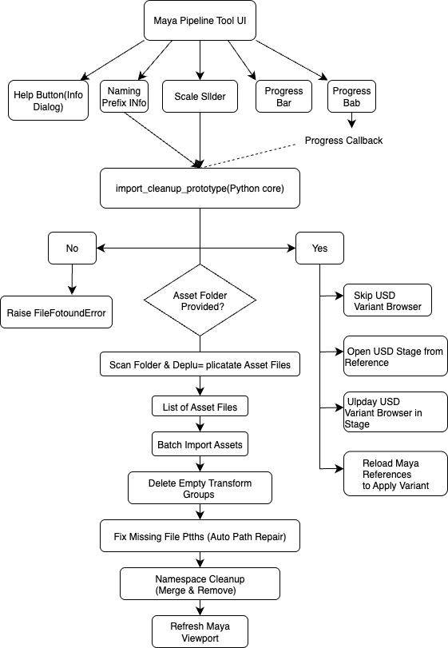

# Asset Import & Prep Tool for Maya + USD

A simple pipeline tool for batch importing, cleanup, and management of 3D assets in Maya, with support for USD (Universal Scene Description) reference, namespace, naming conventions, and collision-safe numbering.

---

##  Features

- **Batch import** multiple assets (FBX, OBJ, MA, MB, USD, USDA, ABC, GLTF/GLB)  
- **USD Import**: choose *Import as Reference* or *Import as Nodes*  
- **Preview Renaming**: see before-and-after names for all assets  
- **Collision-safe naming**: automatically appends `_001`, `_002`, … when a name already exists  
- **Batch Path Repair**: one-click fix of all missing file paths (textures, references)  
- **Empty-group cleanup**: delete transform nodes with no children or shapes  
- **Namespace cleanup**: merge & remove all non-UI namespaces  
- **Viewport refresh** after processing  
- **Export Selection to USD**  
- **USD Layer & Variant Browser** (experimental)  

---

##  Requirements

- Autodesk Maya 2022+ (with USD support)  
- `mayaUsdPlugin` enabled  
- Python 3.9+ (bundled with Maya 2022+)  
- PySide2 (bundled with Maya)  
- pxr.Usd (Maya’s built-in USD Python API)  

---

##  Installation

1. **Clone or copy** this repo into your Maya scripts location, for example:  
```

\~/Documents/MScProject/
├── src/import\_cleanup\_prototype.py
├── src/rules/pipeline\_rules.json
└── ui/pipeline\_ui.py

```
2. Create a **test_assets/** folder alongside to hold your models:  
```

\~/Documents/MScProject/test\_assets/

````
3. Make sure your `pipeline_rules.json` lives in `src/rules/`.  

---

## ▶️ Usage

1. **Launch Maya**  
2. Open **Script Editor** → **Python** tab  
3. **Paste & run**:
```python
import sys, importlib

# adjust these paths to your setup
for p in [
    "/home/you/Documents/MScProject/src",
    "/home/you/Documents/MScProject/ui"
]:
    if p not in sys.path:
        sys.path.append(p)

import import_cleanup_prototype, pipeline_ui
importlib.reload(import_cleanup_prototype)
importlib.reload(pipeline_ui)

# show the tool
pipeline_ui.show_pipeline_ui()
````

4. The **Asset Import & Prep Tool** window will pop up.

---

## ⚙️ Typical Workflow

1. **Load Rules** (optional) — pick a different `pipeline_rules.json`
2. **Browse…** to select your asset folder
3. **Preview Renaming** — verify sanitized, prefixed names & collision numbering
4. Check or uncheck:

   * **Enable Naming (prefix=...)**
   * **Enable Path Repair**
   * **Enable Namespace Cleanup**
5. (New!) **Batch Path Repair** — fixes missing paths without re-importing
6. Set **USD Import Mode**
7. Click **Import & Clean**
8. Watch the **log panel** for progress & messages
9. (If “Import as Reference” is on) expand **USD Layers & Variants** to browse
10. **Export Selection to USD** when you want to publish your Maya selection

---

##  Architecture Diagram



---

##  Known Limitations & FAQ

* **Collision-safe naming** only applies to nodes in the current scene, not on-disk files.
* **Referenced USD nodes** can’t be renamed or deleted (read-only).
* If the UI fails to appear, verify your `sys.path` entries and that Maya’s Python tab is active.
* You can manually trigger **Batch Path Repair** at any time to fix broken texture references.

---

##  Example: Generate Test USD with Variants

```python
import os
from pxr import Usd, UsdGeom

usd_path = "/home/you/Documents/MScProject/test_assets/variants_test_demo.usda"
if os.path.exists(usd_path):
    os.remove(usd_path)

stage = Usd.Stage.CreateNew(usd_path)
cube  = UsdGeom.Cube.Define(stage, "/Cube")
vset  = cube.GetPrim().GetVariantSets().AddVariantSet("LOD")
vset.AddVariant("high")
vset.AddVariant("low")
vset.SetVariantSelection("high")
stage.GetRootLayer().Save()

print("Created test USD with variants at:", usd_path)
```

---

##  LICENSE

This project is licensed under the **MIT License**.
© 2025 Flora / MScProject

```

